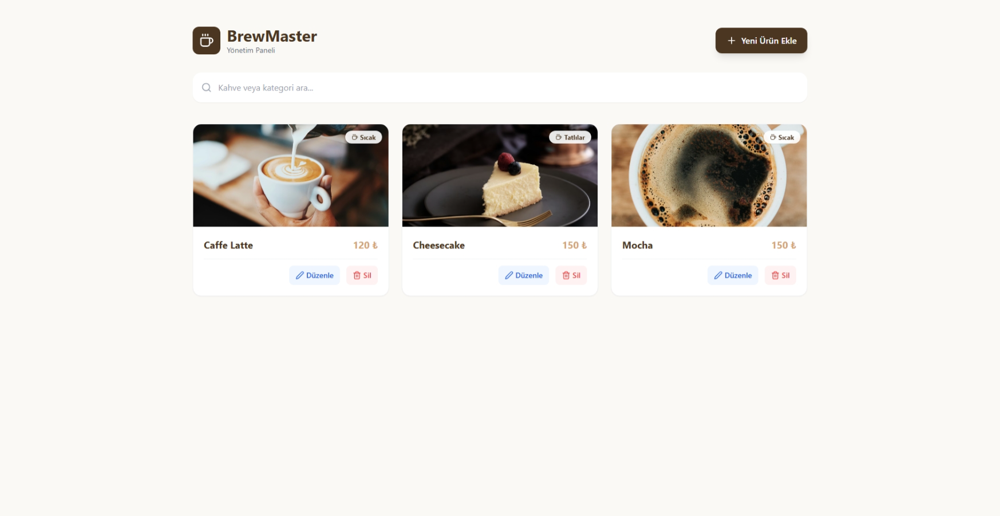

# ☕ BrewMaster - Intelligent Coffee Shop Management System


### 🚀 [Click for Live Demo](https://brewmasteradmin.netlify.app/)

## 🚀 Project Overview

This project is a user-friendly and aesthetic frontend application designed for a modern **Coffee Shop Management System**. Built using **React** and **Vite**, it simplifies menu operations, optimizes product management processes, and provides a seamless administrative experience with a responsive interface.

The application bridges the gap between design and functionality, implementing a pixel-perfect UI based on a custom **Figma** design system.

---

## 🌟 Key Features

* **Dynamic Product Management (CRUD):** Effortlessly Create, Read, Update, and Delete coffee products with real-time state updates.
* **Instant Search & Filtering:** A powerful search mechanism that filters products by name or category instantly.
* **Modern UI/UX Design:** * Designed with **Tailwind CSS** for a sleek, responsive look.
    * Includes **Empty States** and **Loading States** for better user experience.
    * Interactive **Toast Notifications** for user feedback (Success/Error messages).
* **Component-Based Architecture:** Modular structure using `components`, `interfaces`, and `pages` directories for scalability.
* **Responsive Layout:** Fully optimized for Desktop, Tablet, and Mobile devices.

---

## 🛠️ Tech Stack & Tools

| Category | Technology |
| :--- | :--- |
| **Frontend Framework** | React.js (v18) |
| **Build Tool** | Vite |
| **Styling** | Tailwind CSS |
| **Icons** | Lucide React |
| **Notifications** | React Hot Toast |
| **Design Tool** | Figma |
| **Deployment** | Netlify |

---

## 📸 Screenshots


|  |


---

## 📂 Project Structure

This project follows a professional folder structure to ensure maintainability:

```bash
brewmaster-admin/
├── src/
│   ├── components/    # Reusable UI components (ProductCard, Forms, etc.)
│   ├── interfaces/    # Data models and mock data
│   ├── pages/         # Application views
│   ├── App.jsx        # Main application logic
│   └── main.jsx       # Entry point
├── public/            # Static assets
└── tailwind.config.js # Design system configuration


🚀 Getting Started

Follow these steps to run the project locally:

Clone the repository:

Bash
git clone [https://github.com/your-username/brewmaster-admin.git](https://github.com/your-username/brewmaster-admin.git)
Navigate to the project directory:

Bash
cd brewmaster-admin
Install dependencies:

Bash
npm install
Start the development server:

Bash
npm run dev
🎨 Design System
The application uses a specific color palette to reflect the coffee brand identity:

Primary: Espresso (#4B3621)

Secondary: Caramel (#D4A373)

Background: Foam White (#FAF9F6)

Typography: Poppins (Google Fonts)

📄 License
This project is open-source and available under the MIT License.

Developed with  by Muhammet Enes DEMIRKOL
